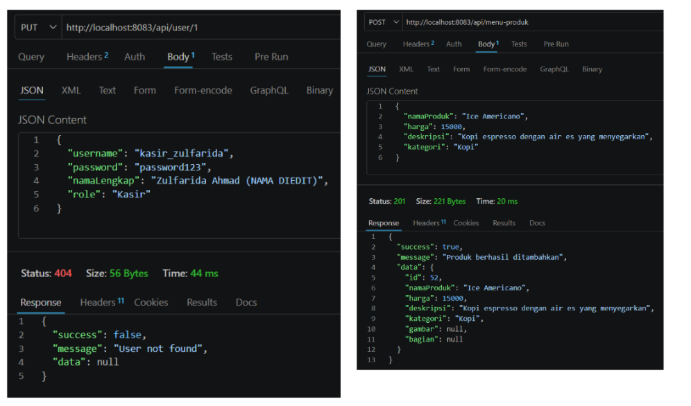
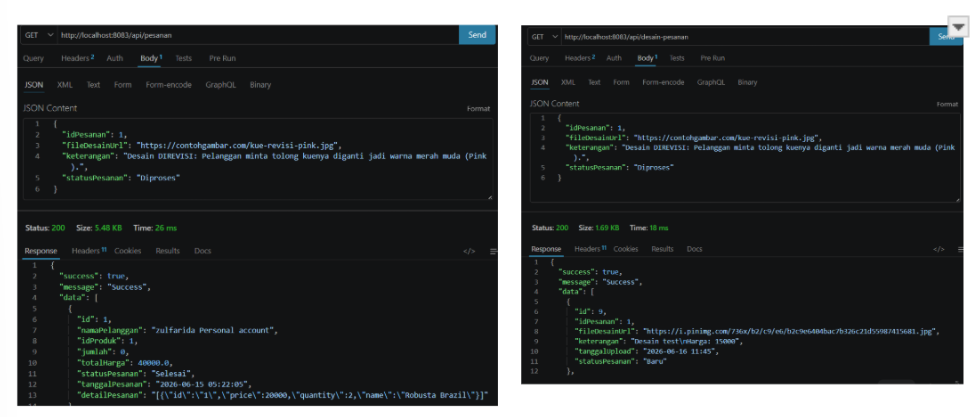
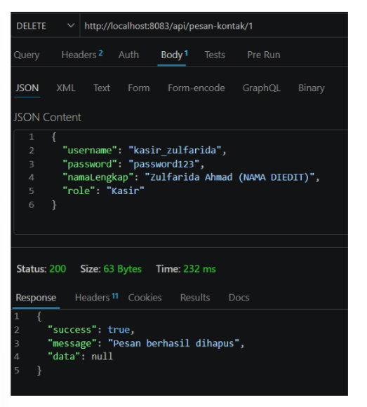
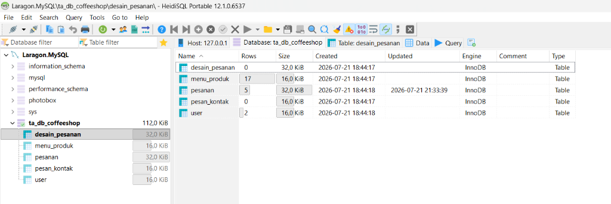
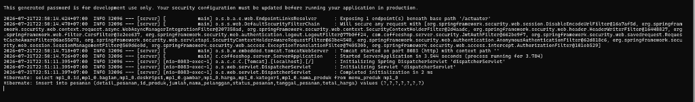
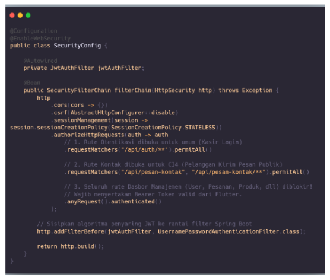
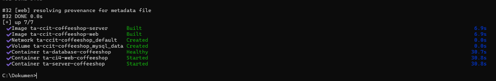
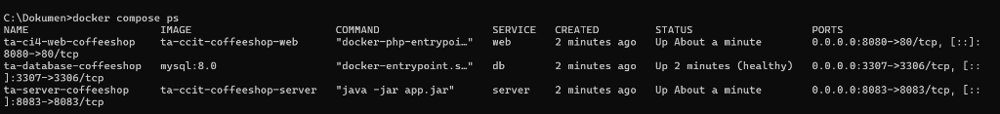

# Classic Coffee Server Backend

Classic Coffee Server Backend — A secure and high-performance Spring Boot REST API serving as the central coordinator for user management, ordering, custom product design review, and database integration.

## Fitur Utama

- **RESTful API Service:** Endpoint lengkap untuk manajemen pengguna, data produk menu, pengelolaan pesanan pelanggan, serta review kue custom.
- **ORM & Database Integration:** Menggunakan Spring Data JPA (Hibernate) untuk komunikasi data yang cepat dan aman dengan MySQL.
- **Relational Integrity:** Validasi Foreign Key dan integritas relasi antar tabel (user, menu_produk, pesanan, dan desain_pesanan).
- **CORS & Security:** Konfigurasi keamanan CORS untuk melayani request dari CodeIgniter 4 Web dan Flutter Client secara bersamaan.

## Keterangan Operasi CRUD

Server backend Spring Boot ini menyediakan antarmuka API RESTful lengkap yang mengelola operasi CRUD (Create, Read, Update, Delete) pada database MySQL untuk entitas berikut:

1. **Entitas User (`/api/users`):**
   - **Create:** Menambahkan user/administrator baru melalui request `POST /api/users`.
   - **Read:** Mengambil daftar seluruh user (`GET /api/users`) atau user spesifik berdasarkan ID (`GET /api/users/{id}`).
   - **Update:** Memperbarui informasi akun user (`PUT /api/users/{id}`).
   - **Delete:** Menghapus akun user dari database (`DELETE /api/users/{id}`).
2. **Entitas Menu Produk (`/api/menu-produk`):**
   - **Create:** Menambahkan item menu kopi atau kue baru via `POST /api/menu-produk`.
   - **Read:** Mendapatkan semua menu (`GET /api/menu-produk`) atau menu tertentu berdasarkan ID (`GET /api/menu-produk/{id}`).
   - **Update:** Memperbarui nama, harga, deskripsi, atau kategori menu (`PUT /api/menu-produk/{id}`).
   - **Delete:** Menghapus item menu dari database (`DELETE /api/menu-produk/{id}`).
3. **Entitas Pesanan (`/api/pesanan`):**
   - **Create:** Membuat pesanan pelanggan baru (`POST /api/pesanan`).
   - **Read:** Mendapatkan daftar seluruh antrean pesanan (`GET /api/pesanan`) atau pesanan spesifik (`GET /api/pesanan/{id}`).
   - **Update:** Mengubah status pengerjaan pesanan dan status pembayaran (`PUT /api/pesanan/{id}`).
   - **Delete:** Membatalkan/menghapus pesanan dari sistem (`DELETE /api/pesanan/{id}`).
4. **Entitas Desain Pesanan / Kue Custom (`/api/desain-pesanan`):**
   - **Create:** Menyimpan pengiriman desain kue custom pelanggan (`POST /api/desain-pesanan`).
   - **Read:** Mendapatkan seluruh kiriman desain kue (`GET /api/desain-pesanan`) atau desain spesifik (`GET /api/desain-pesanan/{id}`).
   - **Update:** Memperbarui catatan pengerjaan atau status desain kue (`PUT /api/desain-pesanan/{id}`).
   - **Delete:** Menghapus pesanan kue custom (`DELETE /api/desain-pesanan/{id}`).
5. **Entitas Pesan Kontak (`/api/pesan-kontak`):**
   - **Create:** Menerima pesan masukan/formulir kontak pelanggan (`POST /api/pesan-kontak`).
   - **Read:** Menampilkan kotak masuk pesan pelanggan (`GET /api/pesan-kontak`).
   - **Update:** Mengubah status pembacaan atau balasan pesan (`PUT /api/pesan-kontak/{id}`).
   - **Delete:** Menghapus pesan masuk dari sistem (`DELETE /api/pesan-kontak/{id}`).

## Teknologi

- **Framework:** Spring Boot (Java)
- **Database Connector:** Spring Data JPA, Hibernate
- **Database:** MySQL
- **Build Tool:** Maven

## Arsitektur Docker

Proyek ini telah dikontainerisasi menggunakan **Docker** untuk memastikan lingkungan pengembangan dan produksi yang konsisten. Sistem berjalan di atas tiga container utama yang saling terhubung dalam satu jaringan (network) Docker:

1. **`ta-database-coffeeshop`**: Container MySQL (Port `3307:3306`) yang menyimpan seluruh data aplikasi.
2. **`ta-server-coffeeshop`**: Container backend Spring Boot (Port `8083:8083`) yang terhubung langsung ke container database.
3. **`ta-ci4-web-coffeeshop`**: Container frontend CodeIgniter 4 (Port `8080:80`) yang melayani antarmuka pelanggan dan berkomunikasi dengan server backend.

Dengan menggunakan `docker-compose`, seluruh environment dapat dibangun (build) dan dijalankan secara serentak tanpa perlu mengonfigurasi Apache, PHP, Java, atau MySQL secara manual di sistem operasi host.

## Panduan Instalasi & Menjalankan Project (menggunakan Docker)

Berikut adalah panduan lengkap menjalankan & mengelola sistem terintegrasi (Server, Web, dan Database) menggunakan **Command Prompt (CMD)** via Docker:

### 1. 🚀 Menyalakan Seluruh Sistem

Buka **Command Prompt (CMD)**, lalu ketik perintah ini:

```cmd
cd C:\Dokumen
docker compose up -d --build
```

> **Penjelasan Perintah:**
> - `cd C:\Dokumen` $\rightarrow$ Pindah ke folder lokasi Master Docker.
> - `up -d` $\rightarrow$ Menyalakan seluruh container di background (agar CMD tidak terkunci).
> - `--build` $\rightarrow$ Memastikan Docker mem-build versi kode terbaru dari Web & Server Anda.

### 2. 📊 Cek Status Container

Untuk melihat apakah semua container sudah aktif dan berjalan normal:

```cmd
docker compose ps
```
*(Anda akan melihat daftar container `ta-ci4-web-coffeeshop`, `ta-server-coffeeshop`, dan `ta-database-coffeeshop` berserta port-nya)*.

### 3. 📜 Melihat Log Sistem (Real-time)

Jika ingin melihat log aktivitas server (misal saat ada transaksi pesanan masuk):

```cmd
docker compose logs -f
```
*(Tekan `Ctrl + C` untuk keluar dari tampilan log)*.

### 4. 🛑 Mematikan Seluruh Sistem

Jika sudah selesai digunakan dan ingin mematikan container:

```cmd
cd C:\Dokumen
docker compose down
```


## Dokumentasi & Demo

Gunakan kolom di bawah ini untuk menambahkan tangkapan layar (screenshot), animasi GIF, atau video dokumentasi aplikasi Anda.

| Fitur | Tampilan Dokumentasi | Deskripsi |
| --- | --- | --- |
| **Endpoint Swagger / API Docs** |  <br>  <br>  | Dokumentasi pengetesan endpoint REST API (User, Menu, Pesanan, Desain Custom, Kontak) menggunakan Postman. |
| **Koneksi Database MySQL** |  | Struktur tabel database `ta_db_coffeeshop` pada HeidiSQL: desain_pesanan, menu_produk, pesanan, pesan_kontak, user. |
| **Log Aktivitas Server** |  | Tampilan log konsol saat server Spring Boot menerima request transaksi. |
| **Cuplikan Kode Proteksi Endpoint (SecurityConfig)** |  | Logika filter keamanan berlapis JWT Spring Boot: endpoint publik CI4 & endpoint privat Flutter Dashboard. |
| **Docker Build & Up** |  | Proses kompilasi image dan inisialisasi container secara serentak menggunakan `docker compose up -d --build`. |
| **Status Container (CLI)** |  | Verifikasi container yang berjalan (Web, Server, DB) beserta port mapping-nya melalui `docker compose ps`. |
| **Docker Desktop UI** |  | Tampilan manajemen visual container, resource usage, dan logs melalui Docker Desktop. |
