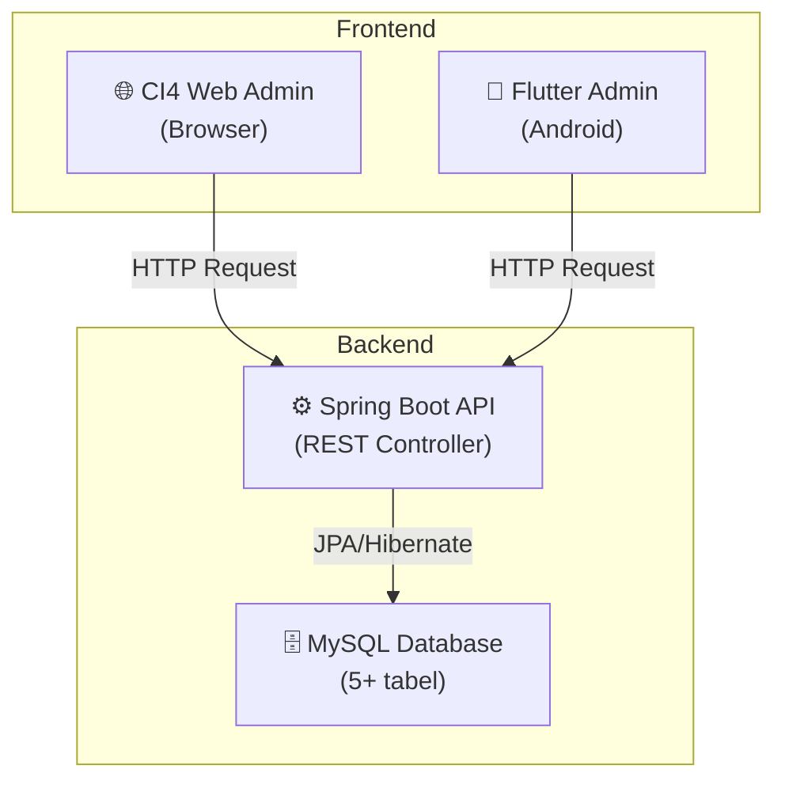

# 📊 Analisis Tugas Akhir — Coffee Shop Project

## 1. Ketentuan TA dari Dosen

| # | Ketentuan | Status Saat Ini | Gap |
|---|-----------|----------------|-----|
| 1 | **Web: CodeIgniter 4 (CI4)** | ✅ Sudah ada web admin CI4 | Perlu integrasi dengan API |
| 2 | **Mobile Apps: Flutter** | ✅ Sudah ada app Flutter | Masih 100% offline (SQLite), perlu diubah ke online via API |
| 3 | **API: Spring Boot** | ❌ **Belum ada** | **Harus dibuat dari nol** |
| 4 | **DB: MySQL (min 5 tabel)** | ⚠️ Sudah ada 5 tabel di SQLite lokal | Perlu migrasi ke MySQL & diakses via Spring Boot API |
| 5 | **Responsive** | ⚠️ Belum diverifikasi | Web CI4 harus responsive, Flutter sudah adaptive by nature |
| 6 | **Blackbox Testing** | ❌ **Belum ada** | Harus dibuat test case & dokumentasi |
| 7 | **Wireframe: Figma (mobile + web)** | ⚠️ Sudah ada tapi belum lengkap | Perlu finalisasi untuk mobile & web |
| 8 | **Hosting** | ⭕ Opsional | - |
| 9 | **Git** | ✅ Sudah pakai Git | Perlu rapikan repository |

---

## 2. Kondisi Proyek Flutter Saat Ini

### 🏗️ Arsitektur
- **100% Offline** — Menggunakan `sqflite` (SQLite lokal di device)
- **Tidak ada HTTP client** — Tidak ada package `http`, `dio`, atau sejenisnya
- **Tidak ada koneksi API** — Semua CRUD langsung ke database lokal
- **State management** — Menggunakan `StatefulWidget` + `setState()` (basic)

### 📦 Database Tables (5 Tabel di SQLite)

| Tabel | Kolom | Fungsi |
|-------|-------|--------|
| `users` | id, nama, email, password, role, foto, created_at | Manajemen user (admin/karyawan) |
| `menu_produk` | id, nama, deskripsi, harga, kategori, gambar, created_at | Katalog menu kopi & makanan |
| `pesanan` | id, nama_pelanggan, items, total_harga, status, metode_pembayaran, catatan, created_at | Pesanan offline |
| `desain_pesanan` | id, nama_pelanggan, deskripsi, gambar, status, created_at | Custom cake orders |
| `pesan_kontak` | id, nama, email, subjek, pesan, tanggal, status, created_at | Pesan masuk dari customer |

> [!NOTE]
> Sudah memenuhi syarat **minimum 5 tabel**, tapi perlu dipindahkan dari SQLite ke MySQL.

### 📱 Screens & Fitur

| Screen | Fitur | CRUD |
|--------|-------|------|
| `login_page` | Login admin/karyawan dengan validasi | R |
| `home_page` | Dashboard dengan navigasi sidebar (drawer) | - |
| `manajemen_user_page` | Kelola admin & karyawan + foto profil | C, R, U, D |
| `menu_produk_page` | Kelola katalog menu + gambar produk | C, R, U, D |
| `daftar_pesanan_page` | Kelola pesanan offline dengan status tracking | C, R, U, D |
| `desain_pesanan_page` | Kelola pesanan custom cake + gambar desain | C, R, U, D |
| `pembayaran_pesanan_page` | Konfirmasi pembayaran & tracking status | R, U |
| `pesan_kontak_page` | Inbox pesan customer + balas via Gmail | D, R (url_launcher) |

---

## 3. 🔍 Gap Analysis — Apa yang Harus Dikerjakan

### ❌ CRITICAL — Harus Dibuat

#### A. Spring Boot REST API (Backend Utama)
Ini adalah **komponen terbesar yang belum ada**. Spring Boot API akan menjadi **jembatan** antara:
- Flutter (mobile) ↔ MySQL
- CI4 (web) ↔ MySQL

```
┌─────────────┐     ┌──────────────────┐     ┌─────────┐
│  Flutter     │────▶│  Spring Boot API  │────▶│  MySQL  │
│  (Mobile)    │◀────│  (REST)           │◀────│  (DB)   │
└─────────────┘     └──────────────────┘     └─────────┘
       ▲                     ▲
       │                     │
┌─────────────┐              │
│  CI4 (Web)  │──────────────┘
│  Admin      │
└─────────────┘
```

**Endpoints yang dibutuhkan:**

| Resource | GET | POST | PUT | DELETE |
|----------|-----|------|-----|--------|
| `/api/auth/login` | - | ✅ | - | - |
| `/api/users` | ✅ | ✅ | ✅ | ✅ |
| `/api/menu-produk` | ✅ | ✅ | ✅ | ✅ |
| `/api/pesanan` | ✅ | ✅ | ✅ | ✅ |
| `/api/desain-pesanan` | ✅ | ✅ | ✅ | ✅ |
| `/api/pesan-kontak` | ✅ | ✅ | - | ✅ |
| `/api/pembayaran` | ✅ | - | ✅ | - |

#### B. Migrasi Database ke MySQL
- Buat skema 5+ tabel di MySQL yang sesuai dengan entity yang sudah ada
- Tambahkan relasi antar tabel (foreign keys)
- Buat seed data untuk testing

#### C. Ubah Flutter dari Offline → Online
- Tambahkan package `http` atau `dio` ke `pubspec.yaml`
- Buat **API Service layer** yang menggantikan `DatabaseHelper` (SQLite)
- Semua CRUD di setiap screen harus dialihkan dari SQLite ke REST API calls

#### D. Blackbox Testing
- Buat **test scenarios** untuk setiap fitur
- Dokumentasikan dalam format tabel:
  - Test Case ID | Skenario | Input | Expected Output | Actual Output | Status (Pass/Fail)
- Minimal test setiap CRUD operation di setiap modul

### ⚠️ PERLU DIPERBAIKI

#### E. Integrasi CI4 Web Admin dengan Spring Boot API
- Web CI4 yang sudah ada harus diubah agar mengambil/mengirim data melalui Spring Boot API
- Bukan langsung query ke MySQL, tapi via HTTP request ke API

#### F. Wireframe Figma
- Buat wireframe lengkap untuk:
  - **Versi Mobile (Flutter)**: Semua 8 screen yang sudah ada
  - **Versi Web (CI4)**: Halaman admin yang sesuai
- Sertakan flow navigasi antar halaman

---

## 4. 💡 Saran & Rekomendasi Strategis

### Saran 1: Fokus ke Admin Dashboard (Bukan User + Admin)

> [!IMPORTANT]
> Berdasarkan diskusi kalian, **fokus ke admin dashboard saja** adalah keputusan yang tepat jika dosen memperbolehkan. Ini mengurangi scope pekerjaan secara signifikan.

Dengan fokus admin:
- ✅ Flutter = Admin mobile app (sudah ada, tinggal integrasi API)
- ✅ CI4 = Admin web dashboard (sudah ada, tinggal integrasi API)
- ✅ Tidak perlu bikin fitur user/customer ordering dari nol
- ✅ Tidak perlu Midtrans (payment gateway yang ribet)

### Saran 2: Arsitektur Yang Direkomendasikan



### Saran 3: Tambahkan 1-2 Tabel Lagi untuk Memperkuat Skema DB

Saat ini sudah ada 5 tabel (minimum terpenuhi). Untuk **nilai lebih**, tambahkan:

| Tabel Baru | Fungsi | Relasi |
|------------|--------|--------|
| `kategori_produk` | Master data kategori (Kopi, Makanan, Minuman, dll) | 1-to-many → `menu_produk` |
| `log_aktivitas` | Audit trail semua aksi admin | many-to-1 → `users` |
| `pembayaran` | Pisahkan data pembayaran dari pesanan | 1-to-1 → `pesanan` |

Ini membuat total menjadi **7-8 tabel** dengan relasi yang lebih kaya, yang lebih baik untuk presentasi.

### Saran 4: Spring Boot API — Gunakan Struktur Standar

```
coffeeshop-api/
├── src/main/java/com/coffeeshop/
│   ├── CoffeeshopApplication.java
│   ├── controller/
│   │   ├── AuthController.java
│   │   ├── UserController.java
│   │   ├── MenuProdukController.java
│   │   ├── PesananController.java
│   │   ├── DesainPesananController.java
│   │   └── PesanKontakController.java
│   ├── model/
│   │   ├── User.java
│   │   ├── MenuProduk.java
│   │   ├── Pesanan.java
│   │   ├── DesainPesanan.java
│   │   └── PesanKontak.java
│   ├── repository/
│   │   ├── UserRepository.java
│   │   ├── MenuProdukRepository.java
│   │   └── ... (JpaRepository)
│   ├── service/
│   │   ├── UserService.java
│   │   └── ...
│   └── config/
│       ├── SecurityConfig.java
│       └── CorsConfig.java
├── src/main/resources/
│   ├── application.properties
│   └── data.sql (seed data)
└── pom.xml
```

---

## 5. 🗓️ Workflow & Timeline Pengerjaan

> [!WARNING]
> Presentasi **18-19 Juni**. Waktu tersisa: **~10 hari**. Harus kerja paralel!

### Pembagian Kerja (2 Orang)

| Hari | Person 1 (Backend Focus) | Person 2 (Frontend Focus) |
|------|--------------------------|---------------------------|
| **Hari 1-2** | Setup Spring Boot project + MySQL schema + Konfigurasi JPA | Wireframe Figma (mobile + web) |
| **Hari 3-4** | Buat semua REST endpoints (CRUD 5 tabel) | Modifikasi Flutter: buat API service layer, ganti SQLite → HTTP |
| **Hari 5-6** | Testing API dengan Postman + Fix bugs | Modifikasi CI4: hubungkan ke Spring Boot API |
| **Hari 7-8** | Integrasi testing (Flutter ↔ API ↔ MySQL) | Responsive testing CI4 web + Finalisasi Figma |
| **Hari 9** | Blackbox testing documentation | Blackbox testing documentation |
| **Hari 10** | Persiapan presentasi + demo | Persiapan presentasi + demo |

### Prioritas Pengerjaan (Jika Waktu Terbatas)

1. 🔴 **P0 — WAJIB**: Spring Boot API + MySQL (ini yang paling critical karena belum ada sama sekali)
2. 🔴 **P0 — WAJIB**: Flutter diubah ke online (koneksi ke API)
3. 🟡 **P1 — PENTING**: CI4 terhubung ke API
4. 🟡 **P1 — PENTING**: Blackbox Testing documentation
5. 🟢 **P2 — NILAI TAMBAH**: Figma wireframe
6. ⚪ **P3 — OPSIONAL**: Hosting & Git cleanup

---

## 6. 📝 Detail Perubahan yang Diperlukan di Flutter

### 6.1 Tambah Dependencies

```yaml
# pubspec.yaml — tambahkan:
dependencies:
  http: ^1.2.0          # HTTP client untuk REST API
  # hapus sqflite jika sudah tidak dipakai:
  # sqflite: ^2.3.2
```

### 6.2 Buat API Service (Pengganti DatabaseHelper)

```dart
// lib/services/api_service.dart
import 'dart:convert';
import 'package:http/http.dart' as http;

class ApiService {
  // Ganti dengan IP server Spring Boot
  static const String baseUrl = 'http://10.0.2.2:8080/api'; // untuk emulator Android
  
  // Contoh: GET semua menu produk
  static Future<List<Map<String, dynamic>>> getMenuProduk() async {
    final response = await http.get(Uri.parse('$baseUrl/menu-produk'));
    if (response.statusCode == 200) {
      return List<Map<String, dynamic>>.from(json.decode(response.body));
    }
    throw Exception('Gagal memuat data');
  }
  
  // Contoh: POST tambah menu baru
  static Future<bool> tambahMenu(Map<String, dynamic> data) async {
    final response = await http.post(
      Uri.parse('$baseUrl/menu-produk'),
      headers: {'Content-Type': 'application/json'},
      body: json.encode(data),
    );
    return response.statusCode == 201;
  }
  
  // ... dst untuk semua entity
}
```

### 6.3 Perubahan di Setiap Screen

Setiap screen yang saat ini memanggil `DatabaseHelper.xxx()` harus diubah menjadi `ApiService.xxx()`.

**Contoh perubahan di `menu_produk_page.dart`:**

```diff
- import '../data/database_helper.dart';
+ import '../services/api_service.dart';

  Future<void> _loadMenuProduk() async {
-   final data = await DatabaseHelper.getMenuProduk();
+   final data = await ApiService.getMenuProduk();
    setState(() {
      _menuList = data;
    });
  }
```

---

## 7. 🧪 Template Blackbox Testing

| No | Test Case ID | Modul | Skenario | Langkah | Input | Expected Result | Actual Result | Status |
|----|-------------|-------|----------|---------|-------|-----------------|---------------|--------|
| 1 | TC-LOGIN-01 | Login | Login dengan kredensial valid | 1. Buka app 2. Masukkan email & password 3. Klik Login | email: admin@test.com, password: admin123 | Masuk ke halaman Home/Dashboard | - | - |
| 2 | TC-LOGIN-02 | Login | Login dengan password salah | 1. Buka app 2. Masukkan email benar & password salah 3. Klik Login | email: admin@test.com, password: wrong | Muncul pesan error "Password salah" | - | - |
| 3 | TC-MENU-01 | Menu Produk | Tambah menu baru | 1. Klik tombol Tambah 2. Isi form 3. Klik Simpan | nama: Cappuccino, harga: 25000, kategori: Kopi | Menu baru muncul di daftar | - | - |
| 4 | TC-MENU-02 | Menu Produk | Edit menu | 1. Klik menu yang ada 2. Ubah harga 3. Klik Update | harga: 30000 | Harga terupdate di daftar | - | - |
| 5 | TC-MENU-03 | Menu Produk | Hapus menu | 1. Klik tombol hapus 2. Konfirmasi | Klik "Ya" | Menu terhapus dari daftar | - | - |
| ... | ... | ... | ... | ... | ... | ... | ... | ... |

> [!TIP]
> Buat minimal **3-5 test case per modul** (Login, User, Menu, Pesanan, Desain, Pesan, Pembayaran). Total minimal **~25-30 test case**.

---

## 8. ✅ Checklist Final Sebelum Presentasi

- [ ] Spring Boot API running & semua endpoint bekerja
- [ ] MySQL database dengan 5+ tabel & seed data
- [ ] Flutter app terhubung ke API (bukan SQLite lagi)
- [ ] CI4 web terhubung ke API
- [ ] Web CI4 responsive di berbagai ukuran layar
- [ ] Wireframe Figma lengkap (mobile + web)
- [ ] Dokumen Blackbox Testing (25+ test case)
- [ ] Demo bisa berjalan lancar (test sebelum presentasi!)
- [ ] (Opsional) Deploy ke hosting
- [ ] (Opsional) Repository Git bersih dengan README yang jelas

---

## 9. 🎯 Kesimpulan & Argumen

### Kelebihan Proyek Saat Ini
1. ✅ Flutter app sudah **lengkap secara fitur** — semua modul admin sudah ada
2. ✅ Sudah memiliki **5 tabel** yang memenuhi syarat minimum
3. ✅ CRUD sudah berjalan di semua modul
4. ✅ UI sudah cukup matang dengan fitur seperti image picker, session management, dan sidebar navigation
5. ✅ Web CI4 admin juga sudah ada

### Yang Perlu Dikejar
1. 🔴 **Spring Boot API** — Ini yang paling urgent. Tanpa ini, ketentuan TA tidak terpenuhi
2. 🔴 **Migrasi offline → online** — Flutter harus bisa komunikasi via API
3. 🟡 **Blackbox Testing** — Dokumentasi wajib, bisa dikerjakan paralel
4. 🟡 **Figma** — Wireframe sudah ada tapi perlu dilengkapi

### Argumen untuk Presentasi
> *"Proyek kami menggunakan arsitektur 3-tier: Flutter sebagai mobile frontend, CodeIgniter 4 sebagai web frontend, dan Spring Boot sebagai REST API backend yang terhubung ke MySQL. Kedua frontend berkomunikasi melalui satu API yang sama, sehingga data tersinkronisasi antara mobile dan web. Kami fokus pada admin dashboard yang mencakup manajemen user, menu produk, pesanan, desain kustom, dan pesan masuk — semuanya dengan CRUD lengkap dan telah diuji melalui blackbox testing."*

> [!CAUTION]
> **Waktu sangat terbatas (~10 hari).** Kunci keberhasilan adalah:
> 1. Segera mulai Spring Boot API (hari ini!)
> 2. Kerja paralel (1 orang API, 1 orang Flutter/Figma)
> 3. Jangan perfeksionis — yang penting semua ketentuan terpenuhi dan bisa di-demo
