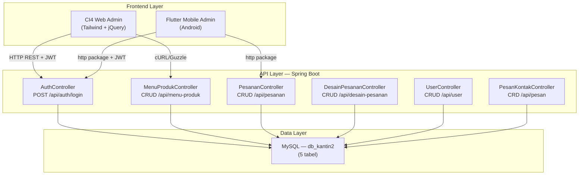
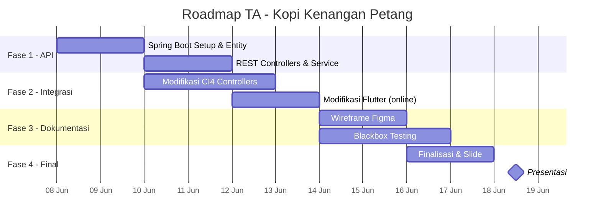

# ☕ Analisis Tugas Akhir — Kopi Kenangan Petang

## Status Proyek Saat Ini

Kalian sudah punya **3 komponen** yang terpisah:

| Komponen | Teknologi | Status |
|---|---|---|
| Web Admin Dashboard | CodeIgniter 4 + Tailwind CSS (CDN) + jQuery | ✅ Fungsional, CRUD lengkap, belum ada API |
| Mobile Admin Dashboard | Flutter + Android Studio | ✅ Fungsional, offline/lokal |
| Web User (Customer) | Midtrans payment gateway | ⚠️ Belum terintegrasi ke admin |

---

## Checklist Gap Analysis vs Ketentuan TA

| # | Ketentuan TA | Status | Gap / Catatan |
|---|---|---|---|
| 1 | **Web: CI** | ✅ Terpenuhi | CI4 admin dashboard sudah jalan dengan CRUD lengkap di 5 modul |
| 2 | **Mobile Apps: Flutter** | ✅ Terpenuhi | Sudah ada aplikasi Flutter admin |
| 3 | **API: Spring Boot** | ❌ **BELUM ADA** | **Gap terbesar**. CI4 sekarang 100% server-rendered MVC, langsung query DB. Tidak ada REST API sama sekali |
| 4 | **DB: MySQL (min 5 tabel)** | ✅ Terpenuhi | 5 tabel: `menu_produk`, `user`, `pesanan`, `desain_pesanan`, `pesan_kontak` |
| 5 | **Responsive** | ✅ Terpenuhi | Tailwind CSS + responsive sidebar + mobile hamburger menu |
| 6 | **Blackbox Testing (utama)** | ❌ **BELUM ADA** | Belum ada dokumentasi/skenario testing sama sekali |
| 7 | **Wireframe: Figma** | ⚠️ Belum selesai | Dari chat: "tinggal figma aja" tapi belum disambungin |
| 8 | **Hosting** | ⚠️ Opsional | Belum di-host |
| 9 | **Git** | ✅ Terpenuhi | Sudah ada `.git` di project CI4 |

---

## 🔴 Masalah Utama & Prioritas

### 1. Spring Boot API — GAP TERBESAR

> [!CAUTION]
> Ini adalah **requirement wajib** dari dosen. Tanpa Spring Boot API, proyek **tidak memenuhi ketentuan TA**.

**Kondisi sekarang:**
- Semua 7 controller CI4 langsung query database via Model dan render view (MVC tradisional)
- Tidak ada REST endpoint yang bisa dikonsumsi oleh Flutter
- Flutter app berjalan offline/lokal — tidak terhubung ke database shared

**Yang harus dibuat — Spring Boot API sebagai middleware/backend:**

```
┌─────────────┐     HTTP/REST     ┌──────────────┐     JDBC/JPA   ┌─────────┐
│  CI4 Web    │ ───────────────── │  Spring Boot │ ────────────── │  MySQL  │
│  (Frontend) │                   │  REST API    │                │db_kantin2│
└─────────────┘                   └──────────────┘                └─────────┘
                                         ▲
┌─────────────┐     HTTP/REST            │
│   Flutter   │ ─────────────────────────┘
│  Mobile App │
└─────────────┘
```

### 2. Blackbox Testing — Requirement "Utama"

> [!IMPORTANT]
> Dosen secara eksplisit menyebut blackbox testing sebagai testing **utama**. Harus ada dokumen skenario test + hasil test + screenshot bukti.

### 3. Integrasi CI4 ↔ Flutter

Dari chat kalian:
> "kita gabisa nyambung kan, yg bisa cm web admin & database aja"

Ini karena belum ada **API layer**. Dengan Spring Boot API, kedua platform bisa berbagi data yang sama.

---

## 🔍 Audit Kode CI4 — Temuan Detail

Berikut temuan dari analisis mendalam kode yang sudah ada:

### Fitur yang Sudah Berjalan ✅

| Modul | Operasi | Detail |
|---|---|---|
| **Menu Produk** | Full CRUD | Validasi lengkap (nama min 3, harga numeric, kategori), pagination 10/page, kategori badge berwarna |
| **Pesanan** | Full CRUD | JOIN ke `menu_produk`, multi-menu ordering via jQuery (dinamis tambah/hapus baris), auto-kalkulasi total |
| **Desain Pesanan** | Full CRUD | JOIN ke `pesanan`, upload URL desain |
| **User** | Full CRUD | Password hashing `bcrypt`, username unique, role dropdown |
| **Pesan Kontak** | CRD (no Edit) | Pagination, detail view, reply via mailto: Gmail |
| **Login/Auth** | Session-based | `password_verify()`, auth filter global |
| **Notifikasi** | Badge count | Tampil jumlah pesan baru di top bar |

### Masalah Kode yang Harus Diperbaiki ⚠️

| # | Masalah | Lokasi | Dampak | Prioritas |
|---|---|---|---|---|
| 1 | **Plain-text password fallback** di login | `LoginCoffeeShopController::auth()` | 🔴 Keamanan — login bisa bypass hash | Tinggi |
| 2 | **DELETE via GET method** | Semua route `destroy` | 🔴 Rentan CSRF, meskipun CSRF filter aktif | Tinggi |
| 3 | **Tidak ada role-based access control** | `Filters/Auth.php` | 🟡 Semua user (admin/karyawan/user) bisa akses semua fitur | Sedang |
| 4 | **Direct DB query di View** | `base.php` (notification count) | 🟡 Melanggar pola MVC — logic di view | Sedang |
| 5 | **Hardcoded stats** | `menu_produk/show.php` | 🟡 "Sales: 142 Cups, Stock: 450" — bukan dari database | Rendah |
| 6 | **Inconsisten variable naming** | `UserController` edit | 🟡 Pakai `$user`, modul lain pakai `$result` | Rendah |
| 7 | **Duplicate/backup files** | `list copy.php`, `list-REAL.php` | 🟡 File sampah di views | Rendah |
| 8 | **Multi-order bug** | `PesananController::store()` | 🟡 Setiap item disimpan dengan `total_harga` yang sama (harusnya per-item) | Sedang |
| 9 | **Tidak ada validasi** di DesainPesanan | `DesainPesananController` | 🟡 Data bisa masuk tanpa validasi | Sedang |
| 10 | **Tidak ada Foreign Key constraint** | Semua migration | 🟡 Index ada tapi FK tidak enforced | Rendah |
| 11 | **Profil page kosong** | `profil.php` | 🟡 Hanya placeholder text | Rendah |
| 12 | **Role mismatch** | Migration vs Controller | 🟡 DB punya 3 role (admin,karyawan,user) tapi UserController hanya izinkan 2 (admin,karyawan) | Rendah |

> [!WARNING]
> **Masalah #1 (plain-text password fallback)** harus diperbaiki sebelum presentasi. Ini bisa jadi pertanyaan dari dosen dan menunjukkan kelemahan keamanan yang fatal.

---

## 💡 Saran & Argumen: Fokus ke Admin Saja

Berdasarkan diskusi kalian dan situasi waktu (**presentasi 18-19 Juni, sekarang 8 Juni = 10 hari**):

> [!TIP]
> **Rekomendasi: Fokus ke Admin Dashboard saja (CI4 + Flutter + Spring Boot API)**

**Alasan:**
1. **Midtrans ≠ requirement dosen** — dosen minta CI + Flutter + Spring Boot, bukan payment gateway
2. **Admin sudah lengkap** — 5 modul CRUD sudah jalan di CI4
3. **Waktu terbatas** — lebih baik 1 sistem terintegrasi sempurna daripada 3 sistem terpisah
4. **Ketentuan TA terpenuhi** hanya dengan admin: CI4 (web) + Flutter (mobile) + Spring Boot (API) + MySQL (DB)

**Tentang Midtrans/Web User:**
- Jadikan **"future development"** di slide presentasi
- Atau ubah jadi **landing page promosi** (sesuai saran Bu Ayu): tampilkan info kopi + link download app

---

## 🏗️ Arsitektur yang Direkomendasikan



### Peran Masing-Masing Komponen

| Komponen | Peran | Contoh |
|---|---|---|
| **Spring Boot API** | Backend terpusat — semua business logic & akses DB | `GET /api/menu-produk`, `POST /api/pesanan` |
| **CI4 Web** | Frontend web admin — consume API via `cURL` | Tampilkan data dari API, kirim form ke API |
| **Flutter App** | Frontend mobile admin — consume API via `http` package | Sama dengan CI4 tapi versi mobile |
| **MySQL** | Penyimpanan data | Satu database `db_kantin2`, diakses **hanya** oleh Spring Boot |

---

## 📋 Workflow Pengerjaan — Roadmap 10 Hari



---

### Fase 1: Spring Boot API (Hari 1–4) ⭐ PRIORITAS UTAMA

#### Spring Boot Project Structure

```
coffeeshop-api/
├── pom.xml                              # Maven dependencies
├── src/main/java/com/coffeeshop/api/
│   ├── CoffeeshopApiApplication.java    # Main class
│   │
│   ├── config/
│   │   ├── SecurityConfig.java          # JWT + CORS
│   │   └── WebConfig.java              # CORS origins whitelist
│   │
│   ├── controller/
│   │   ├── AuthController.java          # Login/register
│   │   ├── MenuProdukController.java    # Menu CRUD
│   │   ├── PesananController.java       # Pesanan CRUD
│   │   ├── DesainPesananController.java # Desain CRUD
│   │   ├── UserController.java          # User CRUD
│   │   └── PesanKontakController.java   # Pesan CRD
│   │
│   ├── model/
│   │   ├── MenuProduk.java              # @Entity → menu_produk
│   │   ├── User.java                    # @Entity → user
│   │   ├── Pesanan.java                 # @Entity → pesanan
│   │   ├── DesainPesanan.java           # @Entity → desain_pesanan
│   │   └── PesanKontak.java             # @Entity → pesan_kontak
│   │
│   ├── repository/
│   │   ├── MenuProdukRepository.java    # JpaRepository<MenuProduk, Integer>
│   │   ├── UserRepository.java
│   │   ├── PesananRepository.java
│   │   ├── DesainPesananRepository.java
│   │   └── PesanKontakRepository.java
│   │
│   ├── service/
│   │   ├── MenuProdukService.java       # Business logic
│   │   ├── UserService.java
│   │   ├── PesananService.java
│   │   ├── DesainPesananService.java
│   │   └── PesanKontakService.java
│   │
│   ├── dto/
│   │   ├── LoginRequest.java
│   │   ├── LoginResponse.java
│   │   └── ApiResponse.java            # Wrapper { success, message, data }
│   │
│   └── security/
│       ├── JwtTokenProvider.java
│       └── JwtAuthFilter.java
│
└── src/main/resources/
    └── application.properties
```

#### application.properties

```properties
# Database — pakai db_kantin2 yang sudah ada
spring.datasource.url=jdbc:mysql://localhost:3306/db_kantin2
spring.datasource.username=root
spring.datasource.password=
spring.datasource.driver-class-name=com.mysql.cj.jdbc.Driver

# JPA — validate (jangan auto-create, tabel sudah ada)
spring.jpa.hibernate.ddl-auto=validate
spring.jpa.show-sql=true
spring.jpa.properties.hibernate.dialect=org.hibernate.dialect.MySQL8Dialect

# Server
server.port=8080

# JWT
jwt.secret=kopi-kenangan-petang-secret-key-2026
jwt.expiration=86400000
```

#### REST API Endpoints

```
── Authentication ──────────────────────────────
POST   /api/auth/login              → { username, password } → { token, user }
POST   /api/auth/logout             → Invalidate token

── Menu Produk ─────────────────────────────────
GET    /api/menu-produk             → List semua produk (+ ?search=keyword)
GET    /api/menu-produk/{id}        → Detail 1 produk
POST   /api/menu-produk             → Tambah produk baru
PUT    /api/menu-produk/{id}        → Update produk
DELETE /api/menu-produk/{id}        → Hapus produk

── Pesanan ─────────────────────────────────────
GET    /api/pesanan                 → List semua pesanan (JOIN produk)
GET    /api/pesanan/{id}            → Detail 1 pesanan
POST   /api/pesanan                 → Buat pesanan baru (support multi-item)
PUT    /api/pesanan/{id}            → Update pesanan
DELETE /api/pesanan/{id}            → Hapus pesanan
PATCH  /api/pesanan/{id}/status     → Update status saja (Baru→Proses→Selesai)

── Desain Pesanan ──────────────────────────────
GET    /api/desain-pesanan          → List semua desain (JOIN pesanan)
GET    /api/desain-pesanan/{id}     → Detail 1 desain
POST   /api/desain-pesanan          → Tambah desain
PUT    /api/desain-pesanan/{id}     → Update desain
DELETE /api/desain-pesanan/{id}     → Hapus desain

── User Management ─────────────────────────────
GET    /api/user                    → List semua user
GET    /api/user/{id}               → Detail 1 user
POST   /api/user                    → Tambah user (password di-hash)
PUT    /api/user/{id}               → Update user
DELETE /api/user/{id}               → Hapus user

── Pesan Kontak ────────────────────────────────
GET    /api/pesan                   → List semua pesan (+ pagination)
GET    /api/pesan/{id}              → Detail 1 pesan
POST   /api/pesan                   → Kirim pesan baru
DELETE /api/pesan/{id}              → Hapus pesan
GET    /api/pesan/count             → Jumlah pesan (untuk notifikasi badge)
```

#### Contoh Entity (MenuProduk.java)

```java
@Entity
@Table(name = "menu_produk")
public class MenuProduk {
    @Id
    @GeneratedValue(strategy = GenerationType.IDENTITY)
    private Integer id;

    @Column(name = "nama_produk", nullable = false, length = 100)
    private String namaProduk;

    @Column(nullable = false, precision = 10, scale = 2)
    private BigDecimal harga;

    @Column(columnDefinition = "TEXT")
    private String deskripsi;

    @Enumerated(EnumType.STRING)
    @Column(nullable = false)
    private Kategori kategori;

    public enum Kategori { Kopi, NonKopi, Pastry }
    
    // getters & setters...
}
```

#### Contoh Controller (MenuProdukController.java)

```java
@RestController
@RequestMapping("/api/menu-produk")
public class MenuProdukController {
    @Autowired
    private MenuProdukService service;

    @GetMapping
    public ResponseEntity<ApiResponse> getAll(@RequestParam(required = false) String search) {
        List<MenuProduk> data = (search != null) ? service.search(search) : service.findAll();
        return ResponseEntity.ok(new ApiResponse(true, "Success", data));
    }

    @PostMapping
    public ResponseEntity<ApiResponse> create(@Valid @RequestBody MenuProduk menu) {
        MenuProduk saved = service.save(menu);
        return ResponseEntity.status(HttpStatus.CREATED)
            .body(new ApiResponse(true, "Produk berhasil ditambahkan", saved));
    }

    @PutMapping("/{id}")
    public ResponseEntity<ApiResponse> update(@PathVariable Integer id, @Valid @RequestBody MenuProduk menu) {
        MenuProduk updated = service.update(id, menu);
        return ResponseEntity.ok(new ApiResponse(true, "Produk berhasil diupdate", updated));
    }

    @DeleteMapping("/{id}")
    public ResponseEntity<ApiResponse> delete(@PathVariable Integer id) {
        service.delete(id);
        return ResponseEntity.ok(new ApiResponse(true, "Produk berhasil dihapus", null));
    }
}
```

---

### Fase 2: Modifikasi CI4 Web (Hari 4–6)

**Ubah CI4 dari direct-DB ke consume Spring Boot API.**

> [!NOTE]
> **View/tampilan CI4 tidak perlu diubah banyak.** Yang berubah adalah controller — dari direct Model query ke HTTP client yang consume API.

#### Sebelum (direct DB):
```php
// MenuProdukController.php — SEKARANG
public function index() {
    $model = new MenuProduk();
    $data['menu'] = $model->paginate(10);
    $data['pager'] = $model->pager;
    return view('menu_produk/list', $data);
}
```

#### Sesudah (consume API):
```php
// MenuProdukController.php — SETELAH MODIFIKASI
public function index() {
    $client = \Config\Services::curlrequest();
    $response = $client->get('http://localhost:8080/api/menu-produk', [
        'headers' => [
            'Authorization' => 'Bearer ' . session('api_token'),
            'Accept' => 'application/json',
        ]
    ]);
    $result = json_decode($response->getBody(), true);
    $data['menu'] = $result['data'];
    return view('menu_produk/list', $data);
}
```

#### Perubahan yang dibutuhkan di CI4:

1. **Controller** — Ganti semua `new Model()` dengan `CurlRequest` ke Spring Boot
2. **Login** — Authenticate via API `POST /api/auth/login`, simpan JWT di session
3. **Config** — Tambahkan constant `API_BASE_URL` di `.env` atau `Config/Constants.php`
4. **Helper** — Buat helper `api_helper.php` untuk wrapper HTTP requests
5. **Views** — Penyesuaian minor (data format mungkin sedikit berbeda dari API response)
6. **Hapus Models** — Models tidak lagi dibutuhkan (opsional, bisa tetap ada untuk reference)

#### Contoh api_helper.php:
```php
// app/Helpers/api_helper.php
function api_get(string $endpoint, ?string $token = null): array {
    $client = \Config\Services::curlrequest();
    $options = ['headers' => ['Accept' => 'application/json']];
    if ($token) {
        $options['headers']['Authorization'] = 'Bearer ' . $token;
    }
    $response = $client->get(getenv('API_BASE_URL') . $endpoint, $options);
    return json_decode($response->getBody(), true);
}

function api_post(string $endpoint, array $data, ?string $token = null): array {
    $client = \Config\Services::curlrequest();
    $options = [
        'headers' => [
            'Accept' => 'application/json',
            'Content-Type' => 'application/json',
        ],
        'json' => $data,
    ];
    if ($token) {
        $options['headers']['Authorization'] = 'Bearer ' . $token;
    }
    $response = $client->post(getenv('API_BASE_URL') . $endpoint, $options);
    return json_decode($response->getBody(), true);
}
```

---

### Fase 3: Modifikasi Flutter App (Hari 5–7)

**Ubah Flutter dari offline/lokal ke consume API:**

```dart
// lib/services/api_service.dart
import 'package:http/http.dart' as http;
import 'dart:convert';

class ApiService {
  // Untuk emulator Android: 10.0.2.2 = localhost host machine
  static const String baseUrl = 'http://10.0.2.2:8080/api';
  String? _token;

  Future<bool> login(String username, String password) async {
    final response = await http.post(
      Uri.parse('$baseUrl/auth/login'),
      headers: {'Content-Type': 'application/json'},
      body: jsonEncode({'username': username, 'password': password}),
    );
    if (response.statusCode == 200) {
      final data = jsonDecode(response.body);
      _token = data['data']['token'];
      return true;
    }
    return false;
  }

  Future<List<dynamic>> getMenuProduk() async {
    final response = await http.get(
      Uri.parse('$baseUrl/menu-produk'),
      headers: {
        'Authorization': 'Bearer $_token',
        'Accept': 'application/json',
      },
    );
    final data = jsonDecode(response.body);
    return data['data'];
  }

  Future<bool> createMenuProduk(Map<String, dynamic> menu) async {
    final response = await http.post(
      Uri.parse('$baseUrl/menu-produk'),
      headers: {
        'Authorization': 'Bearer $_token',
        'Content-Type': 'application/json',
      },
      body: jsonEncode(menu),
    );
    return response.statusCode == 201;
  }
}
```

---

### Fase 4: Wireframe Figma (Hari 6–8)

Buat wireframe untuk **2 versi**:

#### Versi Web (CI4 Admin) — Screen List:
1. Login Page
2. Dashboard / Menu Produk List (tabel + pagination + search)
3. Form Tambah Menu Produk
4. Form Edit Menu Produk
5. Detail Menu Produk
6. Pesanan List (tabel + status badges)
7. Form Tambah Pesanan (multi-item)
8. Desain Pesanan List
9. Form Tambah/Edit Desain
10. Pesan Masuk List
11. Detail Pesan + Reply Button
12. User Management List
13. Form Tambah/Edit User

#### Versi Mobile (Flutter Admin) — Screen List:
1. Splash Screen
2. Login Screen
3. Home / Dashboard (bottom navigation)
4. Menu Produk List (card/grid view)
5. Form Tambah/Edit Produk
6. Pesanan List (card view + status chips)
7. Form Tambah Pesanan
8. Desain Pesanan List
9. Pesan Masuk List
10. User Management List
11. Profile / Settings

> [!TIP]
> **Shortcut**: Karena app sudah jadi, **screenshot** tampilan yang ada → trace di Figma → rapikan layoutnya. Ini jauh lebih cepat daripada desain dari nol!

---

### Fase 5: Blackbox Testing (Hari 7–9)

#### Format Dokumen Blackbox Testing

> [!IMPORTANT]
> Buat minimal **30+ skenario** test. Test **kedua platform** (web CI4 + Flutter mobile). Sertakan **screenshot** bukti untuk setiap test case.

#### A. Modul Autentikasi

| No | Skenario | Input | Expected Result | Actual Result | Status |
|---|---|---|---|---|---|
| TC-01 | Login valid (admin) | username: `admin`, password: `test` | Redirect ke dashboard, session aktif, role admin | | ⬜ |
| TC-02 | Login valid (karyawan) | username: `karyawan01`, password: `test123` | Redirect ke dashboard, role karyawan | | ⬜ |
| TC-03 | Login password salah | username: `admin`, password: `wrongpass` | Pesan error "Login gagal", tetap di halaman login | | ⬜ |
| TC-04 | Login username tidak ada | username: `ghost`, password: `test` | Pesan error "Login gagal" | | ⬜ |
| TC-05 | Login field kosong | username: *(kosong)*, password: *(kosong)* | Validasi HTML5 / pesan error | | ⬜ |
| TC-06 | Akses dashboard tanpa login | Buka `/menu-produk` langsung | Redirect ke `/login` | | ⬜ |
| TC-07 | Logout | Klik tombol Logout | Session dihapus, redirect ke login | | ⬜ |

#### B. Modul Menu Produk

| No | Skenario | Input | Expected Result | Actual Result | Status |
|---|---|---|---|---|---|
| TC-08 | Tampil list menu | Akses `/menu-produk` | Tampil tabel semua produk + pagination | | ⬜ |
| TC-09 | Tambah produk valid | nama: Latte Art, harga: 32000, kategori: Kopi, deskripsi: isi | Data tersimpan, redirect ke list, flash success | | ⬜ |
| TC-10 | Tambah produk nama kosong | nama: *(kosong)* | Pesan validasi error "nama_produk harus diisi" | | ⬜ |
| TC-11 | Tambah produk harga bukan angka | harga: `abc` | Pesan validasi error "harga harus berupa angka" | | ⬜ |
| TC-12 | Edit produk | Ubah harga 25000 → 28000 | Data terupdate, redirect ke list | | ⬜ |
| TC-13 | Hapus produk | Klik delete pada produk | Data terhapus dari list | | ⬜ |
| TC-14 | Detail produk | Klik show pada produk | Tampil halaman detail produk | | ⬜ |

#### C. Modul Pesanan

| No | Skenario | Input | Expected Result | Actual Result | Status |
|---|---|---|---|---|---|
| TC-15 | Tampil list pesanan | Akses `/pesanan` | Tampil tabel pesanan + nama produk + status badge | | ⬜ |
| TC-16 | Buat pesanan 1 item | nama: Budi, produk: Latte, jumlah: 2 | Total auto-hitung, data tersimpan | | ⬜ |
| TC-17 | Buat pesanan multi-item | Tambah 3 baris produk berbeda | Semua item tersimpan, subtotal benar | | ⬜ |
| TC-18 | Edit pesanan | Ubah jumlah dari 2 → 3 | Total harga terupdate | | ⬜ |
| TC-19 | Hapus pesanan | Klik delete | Data terhapus | | ⬜ |
| TC-20 | Update status pesanan | Ubah "Baru" → "Proses" | Status badge berubah warna | | ⬜ |

#### D. Modul Desain Pesanan

| No | Skenario | Input | Expected Result | Actual Result | Status |
|---|---|---|---|---|---|
| TC-21 | Tampil list desain | Akses `/desain-pesanan` | Tampil tabel desain + info pesanan | | ⬜ |
| TC-22 | Tambah desain valid | id_pesanan, url, keterangan | Data tersimpan | | ⬜ |
| TC-23 | Edit desain | Ubah keterangan | Data terupdate | | ⬜ |
| TC-24 | Hapus desain | Klik delete | Data terhapus | | ⬜ |

#### E. Modul Pesan Kontak

| No | Skenario | Input | Expected Result | Actual Result | Status |
|---|---|---|---|---|---|
| TC-25 | Tampil list pesan | Akses `/pesan-kontak` | Tampil tabel pesan masuk + pagination | | ⬜ |
| TC-26 | Detail pesan | Klik show pada pesan | Tampil isi pesan lengkap | | ⬜ |
| TC-27 | Reply pesan | Klik "Balas via Gmail" | Email client terbuka dengan pre-filled subject & body | | ⬜ |
| TC-28 | Hapus pesan | Klik delete | Data terhapus | | ⬜ |
| TC-29 | Kirim pesan baru | nama, email valid, subjek, pesan | Pesan tersimpan | | ⬜ |
| TC-30 | Kirim pesan email invalid | email: `bukanformat` | Pesan validasi error | | ⬜ |

#### F. Modul User Management

| No | Skenario | Input | Expected Result | Actual Result | Status |
|---|---|---|---|---|---|
| TC-31 | Tampil list user | Akses `/user` | Tampil tabel user + role badge | | ⬜ |
| TC-32 | Tambah user valid | username unik, password 5+ char, nama, role | User tersimpan, password ter-hash | | ⬜ |
| TC-33 | Tambah user username duplikat | username yang sudah ada | Pesan error "username sudah digunakan" | | ⬜ |
| TC-34 | Tambah user password terlalu pendek | password: `ab` | Pesan validasi error | | ⬜ |
| TC-35 | Edit user | Ubah nama_lengkap | Data terupdate | | ⬜ |
| TC-36 | Hapus user | Klik delete | User terhapus dari list | | ⬜ |

#### G. Responsivitas & Cross-Platform

| No | Skenario | Input | Expected Result | Actual Result | Status |
|---|---|---|---|---|---|
| TC-37 | Responsive mobile web | Buka di viewport 375px | Layout menyesuaikan, sidebar jadi hamburger | | ⬜ |
| TC-38 | Responsive tablet web | Buka di viewport 768px | Layout menyesuaikan dengan baik | | ⬜ |
| TC-39 | Flutter - Login | Test di emulator | Login berhasil, navigate ke home | | ⬜ |
| TC-40 | Flutter - CRUD Menu | Test di emulator | Semua operasi berjalan via API | | ⬜ |

---

### Fase 6: Finalisasi & Presentasi (Hari 9–10)

**Checklist final:**
- [ ] Spring Boot API running di port 8080
- [ ] CI4 Web consume API (bukan direct DB)
- [ ] Flutter app consume API (bukan offline)
- [ ] Test end-to-end: Tambah produk di CI4 → muncul di Flutter (dan sebaliknya)
- [ ] Wireframe Figma selesai (web + mobile)
- [ ] Dokumen blackbox testing 30+ skenario dengan screenshot
- [ ] Slide presentasi siap
- [ ] Demo live prepared: 3 terminal (Spring Boot + CI4 + Flutter emulator)
- [ ] Push ke Git
- [ ] Bersihkan file backup (list copy.php, list-REAL.php)
- [ ] Perbaiki security issue (hapus plain-text password fallback)

---

## 📊 Ekspansi Database (Opsional)

Saat ini 5 tabel sudah memenuhi minimum. Jika ingin lebih robust:

| Tabel Baru | Deskripsi | Relasi |
|---|---|---|
| `kategori` | Normalisasi kategori produk (bukan ENUM) | 1:N → menu_produk |
| `detail_pesanan` | Multi-item per pesanan (perbaiki bug multi-order) | N:1 → pesanan, N:1 → menu_produk |
| `pembayaran` | Tracking pembayaran terpisah | 1:1 → pesanan |
| `log_aktivitas` | Audit trail aktivitas admin | N:1 → user |

> [!NOTE]
> Menambah tabel `detail_pesanan` akan memperbaiki bug di `PesananController::store()` dimana setiap item multi-order disimpan dengan `total_harga` yang sama. Ini juga menambah jumlah tabel menjadi 6+ yang lebih solid.

---

## 🎯 Ringkasan Rekomendasi Final

| Prioritas | Action Item | Deadline |
|---|---|---|
| 🔴 P0 | Bangun Spring Boot REST API | 8–12 Juni |
| 🔴 P0 | Modifikasi CI4 consume API | 12–14 Juni |
| 🔴 P0 | Modifikasi Flutter consume API | 12–14 Juni |
| 🟡 P1 | Blackbox testing 30+ skenario | 14–16 Juni |
| 🟡 P1 | Wireframe Figma (web + mobile) | 14–16 Juni |
| 🟢 P2 | Perbaiki security issues | 14–15 Juni |
| 🟢 P2 | Bersihkan file backup & hardcoded data | 15–16 Juni |
| 🟢 P2 | Finalisasi slide & demo | 16–17 Juni |
| ⚪ P3 | Hosting (opsional) | Jika sempat |
| ⚪ P3 | Midtrans/web user → "future development" | Skip |

> [!WARNING]
> **Deadline 18-19 Juni = 10 hari.** Jangan buang waktu di fitur baru. Fokus: **Spring Boot API → Integrasi → Testing → Presentasi.**
