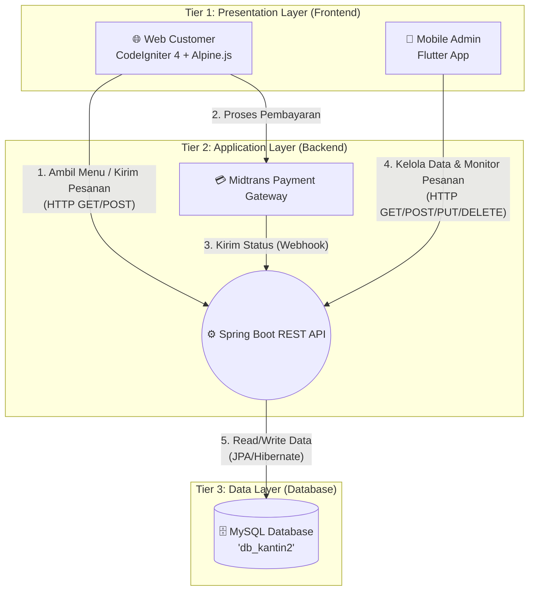

# 📄 Dokumen Induk Tugas Akhir: PRD, Workflow & Blueprint

Dokumen ini adalah rangkuman lengkap (master plan) dari sistem yang akan kita bangun. Dokumen ini sangat berguna untuk bahan penyusunan **Laporan Tugas Akhir** Anda (terutama Bab 3 & Bab 4).

---

## 1. PRD (Product Requirements Document)

**Nama Produk:** Sistem Informasi Pemesanan Coffee Shop Terintegrasi (Classic Coffee)
**Tujuan:** Menyediakan platform digital (Web & Mobile) untuk mempermudah pelanggan melakukan pemesanan kopi secara online, serta memudahkan pihak kedai mengelola operasional (menu, pesanan, kasir) secara real-time.

### A. Target Pengguna (User Persona)
1. **Customer (Pelanggan):** Orang yang ingin membeli kopi atau kue secara online.
2. **Admin/Karyawan:** Staf kedai kopi yang bertugas menerima pesanan, mengelola menu, dan mengelola pembayaran.

### B. Daftar Fitur (Feature Requirements)

**B.1. Fitur Sisi Customer (Web CI4)**
*   Melihat katalog menu produk (Kopi, Non-Kopi, Pastry).
*   Menambahkan produk ke keranjang belanja (Shopping Cart).
*   Melakukan pemesanan (Checkout).
*   Melakukan pembayaran online (Payment Gateway terintegrasi via Midtrans).
*   Mengirim pesan/komentar melalui formulir kontak.

**B.2. Fitur Sisi Admin (Mobile App Flutter)**
*   **Login:** Autentikasi untuk masuk ke dashboard admin.
*   **Manajemen Menu (CRUD):** Tambah, edit, hapus, dan lihat katalog menu.
*   **Manajemen Pesanan:** Melihat pesanan masuk secara real-time dan mengubah status pesanan (Baru -> Proses -> Selesai).
*   **Manajemen Pembayaran:** Verifikasi status pembayaran pelanggan.
*   **Manajemen Pesanan Custom:** Mengelola pesanan desain kue khusus.
*   **Pesan Masuk:** Membaca pesan yang dikirim pelanggan dari Web.
*   **Manajemen User (Admin/Karyawan):** Menambahkan akun staf baru.

### C. Persyaratan Teknis (Sesuai Ketentuan Dosen)
*   Web Frontend: **CodeIgniter 4 (CI4)**
*   Mobile Frontend: **Flutter**
*   Backend API: **Spring Boot**
*   Database: **MySQL** (Min. 5 Tabel)
*   Testing: **Blackbox Testing**
*   Desain: **Figma**

---

## 2. Blueprint (Arsitektur Sistem)

Blueprint ini menggambarkan bagaimana komponen-komponen teknis saling berkomunikasi. Kita menggunakan pola **3-Tier Architecture (Client-Server)**.

**Penjelasan Arsitektur:**
1.  **Data Terpusat:** Baik Web (CI4) maupun Mobile (Flutter) tidak punya database sendiri. Semuanya mengambil dan menyimpan data dari/ke **Spring Boot API**.
2.  **Spring Boot sebagai 'Otak':** Bertugas melayani permintaan data dari CI4 dan Flutter, lalu menyimpannya ke MySQL.
3.  **Midtrans:** Menangani uang secara aman. Ketika pelanggan bayar di Web CI4, Midtrans memprosesnya.

---

## 3. Workflow (Alur Kerja Sistem)

Ini adalah alur (SOP) bagaimana sistem berjalan dari awal sampai akhir pesanan selesai.

### Workflow Utama: Pemesanan & Pembayaran (User Flow)

1.  **Browse Menu:** Customer membuka Web (CI4) -> Web meminta daftar menu ke API (Spring Boot) -> Customer melihat menu.
2.  **Add to Cart:** Customer memilih Kopi Kenangan Mantan & Croissant, lalu masuk ke Keranjang (diatur oleh Alpine.js di browser).
3.  **Checkout:** Customer mengisi data diri (Nama, No HP, Email) dan klik "Checkout".
4.  **Payment (Midtrans):** 
    *   CI4 mengirim total harga ke Midtrans.
    *   Midtrans memunculkan *Pop-up/Snap* pembayaran (Gopay, Virtual Account, dll).
    *   Customer membayar.
5.  **Simpan Pesanan:** Setelah Midtrans menyatakan "Sukses", Web CI4 mengirim rincian pesanan (Data Customer + Menu yang dibeli) ke **Spring Boot API** untuk disimpan di database MySQL dengan status `"Baru"`.

### Workflow Utama: Penerimaan & Pemrosesan (Admin Flow)

6.  **Notifikasi:** Admin yang sedang memegang HP (Aplikasi Flutter) membuka menu "Daftar Pesanan".
7.  **Terima Pesanan:** Flutter menarik data terbaru dari Spring Boot API. Pesanan si Customer tadi muncul dengan status `"Baru"`.
8.  **Proses:** Barista mulai membuat kopi. Admin di Flutter mengubah status pesanan menjadi `"Proses"`. (Flutter mengirim perintah `UPDATE` ke API).
9.  **Selesai:** Kopi siap diambil/dikirim. Admin di Flutter mengubah status menjadi `"Selesai"`.

### Workflow Manajemen (Admin Only)

*   **Tambah Menu Baru:** Admin buka Flutter -> Masukkan foto dan harga Kopi baru -> Simpan -> Flutter kirim ke API -> Tersimpan di MySQL.
*   **Dampaknya:** Saat Customer buka Web (CI4), kopi baru tersebut otomatis muncul karena web menarik data dari database yang sama (via API).

---

## 4. Keunggulan Sistem Ini (Untuk Dipresentasikan)
*   **Integrasi Penuh:** Perubahan data di aplikasi Mobile langsung berdampak ke Web, begitu juga sebaliknya.
*   **Pemisahan Tugas (Separation of Concerns):** CI4 fokus memanjakan pembeli dengan UI yang cantik, Flutter fokus memberi alat kerja yang efisien untuk admin kedai.
*   **Keamanan Pembayaran:** Pembayaran tidak diurus manual, melainkan menggunakan standar industri (Midtrans).
*   **Arsitektur Skalabel:** Menggunakan Spring Boot API membuat sistem ini bisa diperluas kapan saja (misal besok mau bikin aplikasi iOS, tinggal colok ke API yang sama).
